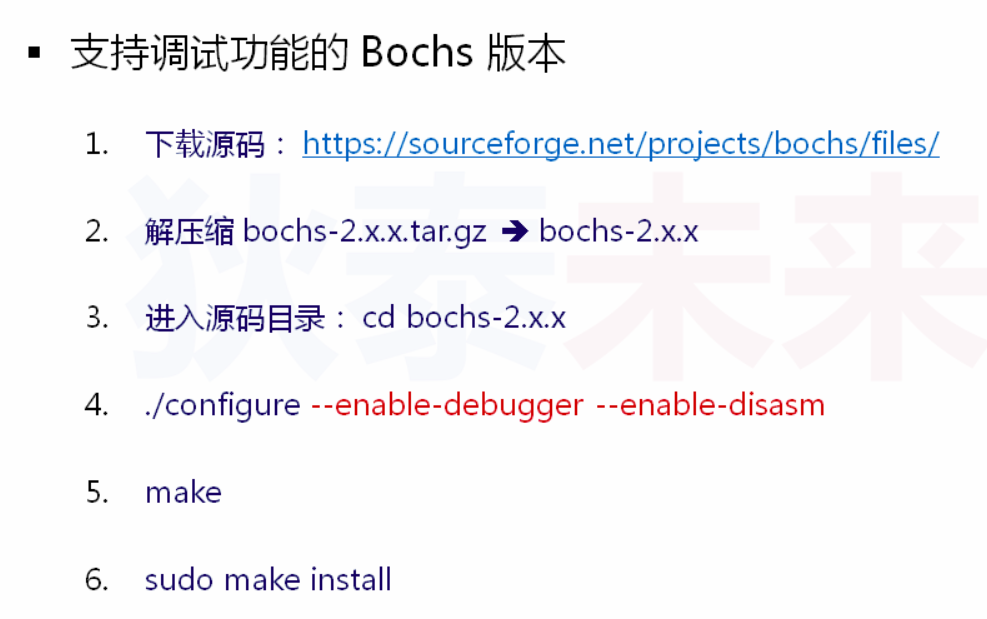

### 编译Boot
```
nasm boot.asm -o boot.bin  
bximage a.img -q -fd -size=1.44  
dd if=boot.bin of=a.img bs=512 count=1 conv=notrunc  
```

### 安装vmware虚拟机（过程忽略）
设置引导img 为a.img


vimware可以正常运行Boot，下面介绍bochs的安装过程

### 安装bochs


### 可能缺少的库
sudo apt-get install libx11-dev libxext-dev
sudo apt-get install libgtk2.0-dev

### 用bochs运行

